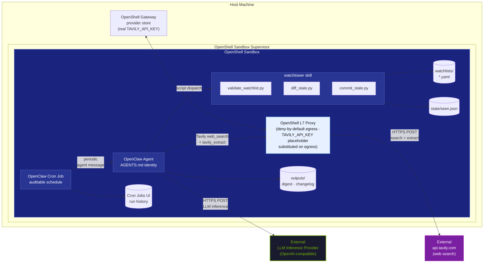

# Watchtower: Scheduled Web Surveillance with Tavily

Watchtower is an unattended web-surveillance agent built on the NemoClaw
OpenClaw harness. A `watchlist.yaml` defines the topics to monitor, optional
seed sources, optional excluded domains, and recency hints. An OpenClaw Cron
Job periodically invokes the agent; each sweep runs Tavily `web_search`,
deterministically diffs the results against a persistent seen-items state file,
uses `tavily_extract` when snippets are not enough, judges the significance of
only the genuinely new items, and writes a cited Markdown digest plus a
structured JSON changelog to `outputs/`. State advances only after the digest
is written, so a crashed run re-processes items on the next sweep instead of
losing them.

The design principle throughout: **scripts enforce mechanics; the agent makes
editorial judgments**. Dedup and explicit negative filters are deterministic
Python — never LLM memory. The LLM decides the questions scripts cannot answer:
is a new result relevant, is the source credible, and how significant is it
given why the topic is being watched?

## Architecture



The sandbox's only research egress is `api.tavily.com`, through the OpenShell
L7 proxy. The Tavily API key lives in the OpenShell provider store on the
host; inside the sandbox the agent only ever sees the canonical placeholder
`openshell:resolve:env:TAVILY_API_KEY`, which the proxy substitutes on
egress. The real key never enters the sandbox.

## How it works

Each sweep follows the procedure in
[`skills/watchtower/SKILL.md`](skills/watchtower/SKILL.md):

1. **Validate** — `validate_watchlist.py` fail-fast checks the active
   watchlist schema (every topic needs `id`, `query`, and `why_it_matters`;
   `seed_sources`, `exclude_domains`, and `lookback_days` are optional). An
   invalid watchlist stops the run before any search.
2. **Search** — per topic, the agent runs 1-2 `web_search` queries built from
   the topic's `query`. Optional `seed_sources` can add one source-biased query,
   and optional `lookback_days` biases searches toward recent results.
3. **Diff** — every result is collected as a JSON line
   (`topic_id`, `url`, `title`, plus optional snippet/content fields) and piped
   through `diff_state.py`, which deterministically drops anything already in
   `state/seen.json`, anything for an unknown topic, and anything matching the
   topic's optional `exclude_domains`.
4. **Extract + judge** — only the survivors reach the LLM. If the search
   snippet is not enough, the agent uses `tavily_extract` on those surviving
   URLs, then rates relevance, credibility, and significance against the
   topic's `why_it_matters`. Noise is logged as skipped with a one-line reason
   instead of digested.
5. **Write** — the agent writes `outputs/digest-<run-id>.md` (per topic: what
   changed, why it matters, source links — or a short "no changes" digest)
   and `outputs/changelog-<run-id>.json` (array of
   `{topic_id, url, title, significance, summary}`).
6. **Commit** — only after both files exist, the digested items are piped to
   `commit_state.py`, which appends them to `state/seen.json` atomically
   (write temp + rename). If the run crashes before this step, state has not
   advanced and the next sweep re-processes the same candidates.

Sample output from a sweep is checked in under
[`outputs/sample/`](outputs/sample/).

## Setup

### Prerequisites

- A Linux host with Docker (see the
  [NemoClaw prerequisites](https://docs.nvidia.com/nemoclaw/)).
- NemoClaw installed. If `nemoclaw` is not on your PATH yet, install it —
  the acceptance variable must be on the `bash` side of the pipe:

  ```bash
  curl -fsSL https://www.nvidia.com/nemoclaw.sh | NEMOCLAW_ACCEPT_THIRD_PARTY_SOFTWARE=1 bash
  ```

- A `TAVILY_API_KEY` (from <https://app.tavily.com>) and credentials for an
  inference path with tool calling — NVIDIA Endpoints
  (`NVIDIA_INFERENCE_API_KEY` from <https://build.nvidia.com>) or any
  OpenAI-compatible endpoint. See [`.env.example`](.env.example).

### Scripted setup

```bash
git clone https://github.com/NVIDIA/nemoclaw-community.git
cd nemoclaw-community/examples/watchtower

cp .env.example .env      # then edit: TAVILY_API_KEY + inference credentials
bash scripts/onboard.sh   # non-interactive `nemoclaw onboard`, Tavily web search
bash scripts/install.sh   # push skill, watchlists, AGENTS.md into the sandbox
bash scripts/start.sh     # create the auditable OpenClaw Cron Job
```

`scripts/onboard.sh` scripts *through* `nemoclaw onboard --non-interactive`:
it exports `NEMOCLAW_WEB_SEARCH_PROVIDER=tavily` and your `.env` answers,
then hands off to the wizard. That single onboarding step provides
everything Watchtower needs from the platform: the built-in `web_search`
tool wired to the Tavily provider, the key stored as an OpenShell provider
placeholder, and the Tavily egress policy on the sandbox. The script is
idempotent — if the sandbox already exists it prints its status and exits.

`scripts/install.sh` uses `openshell sandbox upload` to place the skill at
`/sandbox/.openclaw/skills/watchtower/`, the watchlists and `AGENTS.md` in
the agent workspace, and creates empty `state/` and `outputs/` directories.
Override the workspace for named agents with
`WORKSPACE=/sandbox/.openclaw/workspace-main`, and the sandbox name with
`NEMOCLAW_SANDBOX_NAME` (default `watchtower`).

### Manual path (the moving parts)

The scripts do nothing you cannot do by hand:

```bash
export NEMOCLAW_WEB_SEARCH_PROVIDER=tavily TAVILY_API_KEY=<your-key>
export NEMOCLAW_PROVIDER=build NVIDIA_INFERENCE_API_KEY=<your-key>
export NEMOCLAW_SANDBOX_NAME=watchtower
nemoclaw onboard --non-interactive

openshell sandbox exec --name watchtower -- mkdir -p \
  /sandbox/.openclaw/skills/watchtower /sandbox/.openclaw/workspace/watchlists \
  /sandbox/.openclaw/workspace/state /sandbox/.openclaw/workspace/outputs
openshell sandbox upload watchtower skills/watchtower/ /sandbox/.openclaw/skills/watchtower/
openshell sandbox upload watchtower watchlists/ /sandbox/.openclaw/workspace/watchlists/
openshell sandbox upload watchtower prompts/AGENTS.md /sandbox/.openclaw/workspace/
openshell sandbox exec --name watchtower -- \
  openclaw cron add --name watchtower-dev-ecosystem --agent main \
    --session isolated --every 24h --no-deliver --timeout-seconds 900 \
    --message "Run a watchtower sweep of watchlists/dev-ecosystem.yaml."
```

`watchlists/dev-ecosystem.yaml` is the default preset used in the demo below;
`watchlists/regulatory.yaml` is a second preset you can swap in (see
[Watchlists](#watchlists)).

## Running one sweep

Run a sweep in three stages to see the state machine work:

**1. Fresh state → baseline digest.** With no `state/seen.json`, everything
the search finds is new:

```bash
bash scripts/sweep.sh
```

The agent writes `outputs/digest-<run-id>.md` with every relevant new item it
found, and `state/seen.json` now records the digested URLs.

**2. Immediate re-run → "no changes", proving dedup.** Run the same command
again right away:

```bash
bash scripts/sweep.sh
```

The same search results come back, but `diff_state.py` drops them all as
already seen — the digest is a short "no changes" report. The dedup is
deterministic script output, not the LLM remembering.

**3. Restore the example state → realistic incremental digest.** Replace the
state file with the checked-in fixture, which is pre-seeded with a handful of
already-seen items for the dev-ecosystem topics:

```bash
openshell sandbox upload watchtower state/seen.json.example /sandbox/.openclaw/workspace/state/
openshell sandbox exec --name watchtower -- mv \
  /sandbox/.openclaw/workspace/state/seen.json.example \
  /sandbox/.openclaw/workspace/state/seen.json
```

Then run `bash scripts/sweep.sh` once more. Now the run produces what a
steady-state scheduled run looks like: older releases are filtered as seen,
and only items newer than the fixture appear in the digest.

`scripts/sweep.sh` takes an optional watchlist path (relative to the agent
workspace) as its first argument, e.g.
`bash scripts/sweep.sh watchlists/regulatory.yaml`.

## Scheduling

Create an OpenClaw Cron Job:

```bash
bash scripts/start.sh
```

By default this creates a `watchtower-dev-ecosystem` job that runs every 24
hours. The schedule and run history are visible in the OpenClaw dashboard's
**Cron Jobs** page; the host scripts are only convenience wrappers:

```bash
bash scripts/status.sh   # cron scheduler status, jobs, recent runs, latest outputs
bash scripts/stop.sh     # remove Watchtower cron jobs
```

Use another watchlist or interval with arguments:

```bash
bash scripts/start.sh watchlists/regulatory.yaml 5m
```

Integer intervals are accepted for convenience and converted to OpenClaw
durations, so `300` becomes `5m`:

```bash
bash scripts/start.sh watchlists/regulatory.yaml 300
```

Or set the same defaults in `.env`:

```env
WATCHTOWER_WATCHLIST=watchlists/dev-ecosystem.yaml
WATCHTOWER_EVERY=24h
WATCHTOWER_TIMEOUT_SECONDS=900
WATCHTOWER_JOB_NAME=watchtower-dev-ecosystem
```

Because state only advances after a digest is written, a run that fails
mid-sweep (endpoint outage, sandbox restart) simply re-processes the same
items on the next scheduled run — no items are lost and no manual state repair
is needed.

## Watchlists

A watchlist is a YAML file with one required top-level name and a list of
topics. Each topic has required intent fields plus optional search hints and
negative filters:

```yaml
watchlist: dev-ecosystem
topics:
  - id: nemotron-releases
    query: "new Nemotron model release announcement"
    seed_sources: [huggingface.co, developer.nvidia.com]
    exclude_domains: [wikipedia.org]
    lookback_days: 14
    why_it_matters: "Track new model drops relevant to NemoClaw users"
```

Per topic:

| Key | Purpose |
|---|---|
| `id` | Stable identifier; used in state, digests, and changelogs. Do not rename an id casually — state entries are keyed to it. |
| `query` | The search intent, phrased for a web search engine. |
| `seed_sources` | Optional source hints. The agent may run a source-biased query using `site:` operators, but these are not a hard allowlist. |
| `exclude_domains` | Optional hard negative filter for noisy hosts. Subdomains match, and `diff_state.py` enforces this mechanically. |
| `lookback_days` | Optional recency hint. The agent should bias searches toward this window, but Tavily/search freshness is still judged from returned result content. |
| `why_it_matters` | The significance yardstick the LLM judges new items against, and the "why it matters" line in digests. |

To edit, change the YAML and re-run — `validate_watchlist.py` runs at the
start of every sweep and fails fast on schema violations. To monitor a
different topic set, swap the preset:
[`watchlists/regulatory.yaml`](watchlists/regulatory.yaml) tracks EU PFAS
restriction updates, OFAC sanctions designations, and FDA device recalls.
Presets share one state file safely — state items are keyed by topic id and
URL — but if you want independent sweep histories, point each preset's runs at
its own `--state` path.

## Security model

- **Deny-by-default egress.** The sandbox reaches nothing except what its
  policy names. For research, that is exactly one host: `api.tavily.com`
  through the L7 proxy. Tavily is the agent's only window to the web —
  there is no direct page fetching and no other outbound route.
- **The key never enters the sandbox.** The Tavily API key is stored in the
  OpenShell provider store on the host. Inside the sandbox, requests carry
  the placeholder `openshell:resolve:env:TAVILY_API_KEY`; the L7 proxy
  substitutes the real key on egress. A fully compromised sandbox can spend
  your search quota but cannot exfiltrate the credential.
- **Mechanical filters are enforced, not requested.** `seed_sources` steer the
  search engine, but only as hints. Hard negative filters (`exclude_domains`)
  and dedup are handled by `diff_state.py`, a deterministic script the LLM
  cannot talk its way around. "Is this new?" is answered by the state file,
  never by model memory.
- **Crash-safe state.** `commit_state.py` writes atomically
  (temp file + rename) and runs only after outputs exist, so no failure mode
  leaves the state file corrupt or silently skips items.
